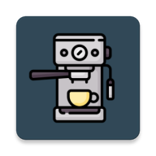

# Coffee House
<p align="center">
  
</p>

## ☕ Описание
Coffee House это приложение для заказа и оплаты продуктов онлайн. Приложение разрабатывается с учетом архитектуры MVVM. Приложение разрабатывается для сдачи в качестве курсовой работы, со временем будет дорабатываться для представления ее в виде дипломной работы и "пет" проекта. 

## 🛠️ Технические характеристики
Приложение имеет следующие характеристики:

* Язык интерфейса: Английский
* Язык программирования: Java
* Хранилище: только локальное
* Поддерживаемая версия Андроид: 7.0+
* Android gradle plugin: 7.3.0
* Требуется свободного места: 50 мб

## 🔭 Планируется в будущем
В будущем планируется добавить следующие нововведения:

* Поддержка нескольких языков для интерфейса
* Переход на язык программирования Kotlin
* Подключение удаленного сервера
* Поддержка темной темы
* Добавление возможности заказа на дом
* Добавление бонусные очков
* Добавление чата с поддержкой и курьеров

## 🔑 Зависимости
Сборщик Gradle имеет следующие зависимости

```
dependencies {
    implementation 'com.google.dagger:dagger:2.44.2'
    annotationProcessor 'com.google.dagger:dagger-compiler:2.44.2'
    annotationProcessor "androidx.room:room-compiler:2.5.1"
    implementation "androidx.room:room-runtime:2.5.1"
    implementation "androidx.work:work-runtime:2.8.1"
    implementation 'com.google.code.gson:gson:2.9.0'
    implementation 'androidx.appcompat:appcompat:1.6.1'
    implementation 'com.google.android.material:material:1.9.0'
    implementation 'androidx.constraintlayout:constraintlayout:2.1.4'
    implementation 'androidx.navigation:navigation-fragment:2.5.3'
    implementation 'androidx.navigation:navigation-ui:2.5.3'
    testImplementation 'junit:junit:4.13.2'
    androidTestImplementation 'androidx.test.ext:junit:1.1.5'
    androidTestImplementation 'androidx.test.espresso:espresso-core:3.5.1'
}
```

## ⚙️ Сборка и установка
На данном этапе, приложение не требует специальных инструкций для сборки и запуска проекта. Выполняеются стандартные действия:
Чтобы скачать репозиторий, введите комманду:
```
git clone https://github.com/Ikrom27/CoffeeHouse.git
```
Чтобы собрать проект, введите комманду
```
./gradlew build
```
Готовый APK вы можете найти в разделе [Release](https://github.com/Ikrom27/CoffeeHouse/releases)

## ©️ Авторы
Работа выполняется Хасанбаевым Икромжоном, ИКБО-07-21.<br>
Так же в разработке серверной части приложение учавствует [Иван Рузин](https://github.com/echoeszzz), ИКБО-06-21

## 🔬 Смотрите так же
Репозиторий разработки серверной части приложения - [coffee-house-server](https://github.com/echoeszzz/coffee-house-server)
